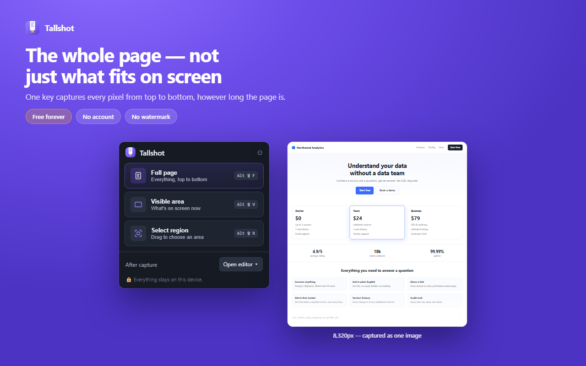

# Tallshot

**Capture the whole page. Keep it yours.**

A Chrome extension that captures any web page — the visible area, a dragged region, or the entire scrollable page — and opens it in a fast local editor where you can annotate, redact and export. No account, no watermark, no limits, and nothing ever leaves your browser.



---

## Why another screenshot extension

Three things go wrong with full-page screenshots, and most tools solve none of them:

| Problem | What Tallshot does |
|---|---|
| **Sticky headers repeat down the image** | Fixed elements are frozen during capture and appear once, at the top. Sticky elements are made static so they render in their real position. Everything is restored afterwards. |
| **Lazy images come out blank or grey** | The page is scrolled end-to-end first, images are given time to decode, and the page is re-measured before a single frame is captured. |
| **Long pages fail or truncate** | Chrome throttles screen capture to 2 frames per second and the limit cannot be raised. Captures are paced against that quota with exponential backoff, so long pages finish instead of aborting. |

And two things that go wrong with the business model:

- **Editing is usually paywalled.** Here it is not, and it never will be — see [the commitment](#the-free-commitment).
- **Redaction usually isn't there at all.** Blur and pixelate are built in and free.

---

## Features

**Capture**
- Full page — every pixel from top to bottom
- Visible area — what's on screen right now
- Region — drag to select, with arrow-key nudging and a live dimension readout

**Edit**
- Arrow, rectangle, ellipse, line, freehand pen, highlighter
- Text with an automatic contrast halo
- Numbered step badges for walkthroughs
- **Blur** and **pixelate** for redacting anything sensitive
- Crop, full undo/redo, zoom and fit

**Export**
- PNG, JPG, WebP
- PDF — paginated to A4 so a 9,000px page prints properly, or one continuous page
- Copy straight to the clipboard
- Custom filename templates (`{host}`, `{date}`, `{title}`, and more)

**Keyboard**

| Shortcut | Action |
|---|---|
| `Alt+Shift+F` | Capture full page |
| `Alt+Shift+V` | Capture visible area |
| `Alt+Shift+R` | Select a region |
| `Esc` | Cancel a capture |

The editor is fully keyboard-driven too — press `?` inside it for the complete map.

---

## Privacy

Tallshot's privacy claim is **structural, not a promise**:

- **No host permissions.** The manifest requests `activeTab`, which grants access to a single tab, only after you explicitly invoke Tallshot, and revokes it on navigation. There is no `<all_urls>`, so Tallshot is incapable of reading pages you did not point it at. Chrome shows **no site-access warning** when you install it.
- **No network code.** There is no `fetch` to any remote origin anywhere in this codebase, no analytics, no telemetry, no remote configuration, and no server. The only `fetch` calls target `data:` and `blob:` URLs the extension created itself.
- **No content leaves your device.** Captures are stitched, edited and saved entirely in your browser.
- **Nothing is retained.** A capture is held in IndexedDB only long enough for the editor tab to open, then deleted. Anything orphaned is swept after 30 minutes.
- **Settings only.** The sole thing stored long-term is your preferences, in `chrome.storage.sync`.

Full policy: **https://owncoder.github.io/tallshot/**

### Permissions, and why each one exists

| Permission | Why | Install warning |
|---|---|---|
| `activeTab` | Capture the current tab and inject the capture logic into it | None |
| `scripting` | Inject the capture agent on demand instead of running on every page you visit | None |
| `downloads` | Save the finished image | None |
| `storage` | Remember your settings | None |
| `contextMenus` | Right-click → capture | None |

Not requested: `<all_urls>`, `host_permissions`, `tabs`, `debugger`, `offscreen`, `unlimitedStorage`, `cookies`, `history`.

---

## The free commitment

Everything in version 1.0 is free, forever:

- No watermark
- No account or sign-in
- No capture limit
- No export limit
- No feature behind a paywall

If a paid tier is ever introduced it will add **new** capability. Nothing that ships free will move behind a paywall. This is enforced in code by [`src/lib/flags.js`](src/lib/flags.js), where every capability is mapped to a tier in a single auditable table, and is documented in [docs/free-vs-pro-plan.md](docs/free-vs-pro-plan.md).

---

## Install

### From the Chrome Web Store

Coming soon.

### From source

```bash
git clone https://github.com/ownCoder/tallshot.git
```

Then:

1. Open `chrome://extensions`
2. Turn on **Developer mode**
3. Click **Load unpacked** and select the `tallshot` folder
4. Press `Alt+Shift+F` on any page

Requires Chrome 116 or newer.

---

## Development

Zero runtime dependencies and zero build step. The source in `src/` is exactly what ships.

```bash
npm run icons        # render assets/icons/*.png from code
npm run screenshots  # render store images with headless Chrome
npm run verify       # pre-submission self-audit
npm run build        # produce Store Upload/Extension.zip
npm run release      # all of the above, then assemble Store Upload/
```

`npm run verify` fails on a missing referenced file, a manifest mismatch, an undocumented permission, any use of `eval`/`new Function`, any remote network call, or a version mismatch between `manifest.json`, `package.json` and `CHANGELOG.md`. The submission ZIP cannot be built from a tree that fails the audit.

### Layout

```
src/
  background/service-worker.js   capture state machine, stitching, delivery
  lib/                           pure modules — no DOM or chrome.* at import time
  capture/                       injected on demand; never a declared content script
  popup/  editor/  options/      the three UI surfaces
  ui/theme.css                   design tokens shared by all three
tools/                           dependency-free build and asset generation
docs/                            product, design and compliance documentation
```

The capture engine is documented in [docs/architecture.md](docs/architecture.md) §4.

---

## Known limitations

Stated plainly rather than discovered later:

- **Chrome blocks capture on `chrome://` pages, the Web Store, and the built-in PDF viewer.** This applies to every extension. Tallshot detects it before you click and says so.
- **Pages taller than Chrome's canvas ceiling (~16,384px per side) are scaled down** to fit, and the editor tells you the exact percentage rather than silently emitting a blank image.
- **Capture speed is bounded by Chrome.** Two frames per second is a browser limit, so a 20-viewport page takes roughly 11 seconds. No extension can go faster.
- **Content inside cross-origin iframes and separately-scrolling inner panes** is captured as it appears on screen, not expanded.
- **Freehand annotation is inherently visual** and cannot be operated by screen reader. Every other function — capture, format choice, export, copy, settings — is fully accessible.

---

## Documentation

| Document | Contents |
|---|---|
| [project-overview.md](docs/project-overview.md) | Name, trademark clearance, folder structure |
| [market-research.md](docs/market-research.md) | Competitor analysis and user pain points |
| [product-strategy.md](docs/product-strategy.md) | Audience, personas, positioning, monetisation |
| [branding.md](docs/branding.md) | Palette, typography, logo, voice |
| [ux-plan.md](docs/ux-plan.md) | Flows, wireframes, states, accessibility |
| [architecture.md](docs/architecture.md) | MV3 design, capture engine, storage, performance |
| [free-vs-pro-plan.md](docs/free-vs-pro-plan.md) | Tier boundaries and the technical seam |
| [compliance.md](docs/compliance.md) | Chrome Web Store policy audit |
| [testing-report.md](docs/testing-report.md) | Test plan, results, limitations |
| [growth-plan.md](docs/growth-plan.md) | Route to 5,000 users |
| [store-listing.md](docs/store-listing.md) | Listing copy and keywords |
| [roadmap.md](docs/roadmap.md) | Milestones and risks |

---

## Licence

[MIT](LICENSE) © 2026 ownCoder

Every asset in this repository — icons, illustrations, UI, copy and code — is original work created for this project. No third-party libraries, fonts, icon sets or images are bundled.
